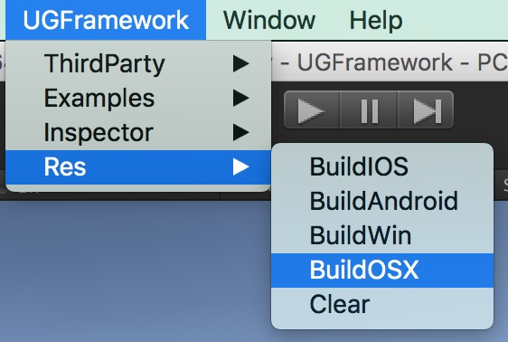
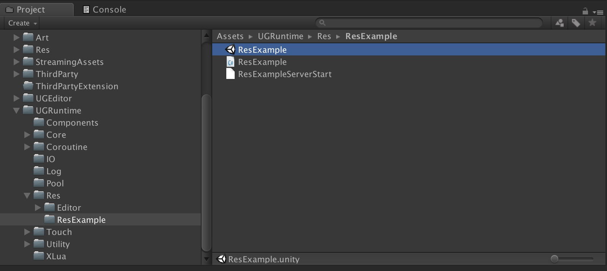
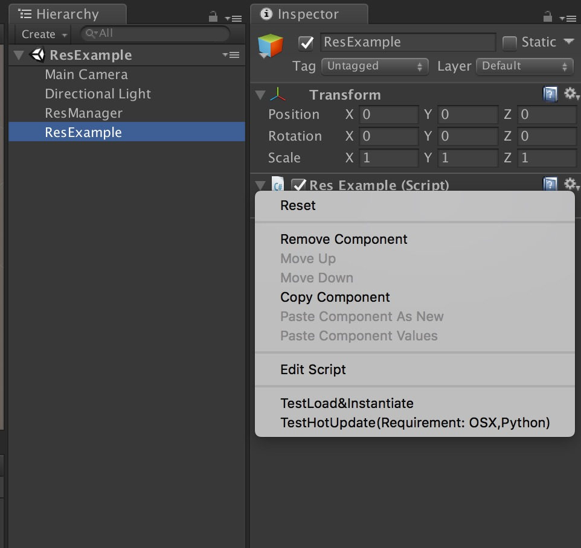

# Current unity version (Recommand use same or above)
2021.3.23f1

# Description
An unity game framework, includes table manager, network manager(tcp, http, udp), some tools, some unity ui components, ai system, and most important is examples.

# Target
Make unity game easiler.

# Features
1. Resources Manager(Editor, iOS, Android), includes AssetBundle build, load, download, save.
2. Log Manager, includes writing log
3. Coroutine Manager, custom coroutine runner.
4. 3D Touch Manager(Editor, iOS, Android), includes Pinch, Drag, Touch.
5. Custom Inspector 

# TODO Features
- Network Manager
- AI (StateMachine, BehaviourTree)
- Object Pool
- Doc generator

# Examples
## Resources load/hotupdate

